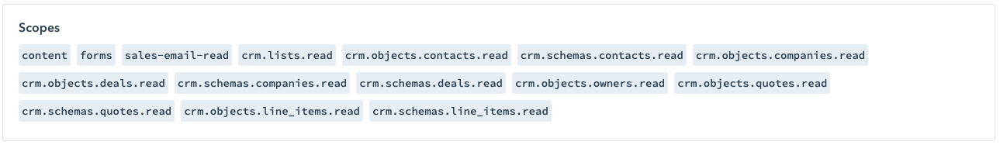

Hubspot Extractor
=============

The HubSpot CRM helps companies grow traffic, convert leads, get insights to close more deals, etc.

This component uses the HubSpot API to extract data of the CRM and Marketing objects from Hubspot

**Table of contents:**

[TOC]

Prerequisites
=============
You need to create a [Private App](https://developers.hubspot.com/docs/api/migrate-an-api-key-integration-to-a-private-app) 
in your account and enable all following scopes:

Supported Endpoints
===================

The following endpoints are downloadable via this component :

* Campaigns
* Companies
* Contacts
* Contact Lists
* Deals
* Deal Line Items
* Email Events
* Marketing Email Statistics
* Forms
* Engagements
  * Calls
  * Emails
  * Notes
  * Meetings
  * Tasks
* Owners
* Pipelines
* Products
* Quotes
* Tickets

If you need more endpoints, please submit your request to
[ideas.keboola.com](https://ideas.keboola.com/)

Additional Endpoint Options
===================

## Additional properties

Endpoint Definitions and their Outputs
======

## Campaigns

The Campaign data is saved into the **campaign.csv** table

## Companies

The Companies data is saved into the **company.csv** table

## Contacts

Contacts store information about individuals, their names, emails, addresses, etc.

The Contacts data is saved into the **contact.csv** table

## Contact Lists

The Contact Lists data is saved into the **contact_list.csv** table

## Deals

The Deals data is saved into the **deal.csv** table

## Deal Line Items

The Deal Line Items data is saved into the **line_item.csv** table

## Email Events

The Email Events data is saved into the **email_event.csv** table

## Marketing Email Statistics

The Marketing Email Statistics data is saved into the **_email_statistic.csv** table

## Forms

The Forms data is saved into the **form.csv** table

## Engagements - Calls

The Calls data is saved into the **call.csv** table

## Engagements - Emails

The Emails data is saved into the **email.csv** table

## Engagements - Notes

The Notes data is saved into the **note.csv** table

## Engagements - Meetings

The Meetings data is saved into the **meetings.csv** table

## Engagements - Tasks

The Tasks data is saved into the **task.csv** table

## Owners

The Owners data is saved into the **owner.csv** table

## Pipelines

The Pipelines data is saved into the **pipeline.csv** and **pipeline_stage.csv** table

## Products

The Products data is saved into the **product.csv** table

## Quotes

The Quotes data is saved into the **quote.csv** table

## Tickets

The Tickets data is saved into the **ticket.csv** table

Configuration
=============

Param 1
-------

Param 2
-------

## Output name

Development
-----------

If required, change local data folder (the `CUSTOM_FOLDER` placeholder) path to
your custom path in the `docker-compose.yml` file:

~~~~~~~~~~~~~~~~~~~~~~~~~~~~~~~~~~~~~~~~~~~~~~~~~~~~~~~~~~~~~~~~~~~~~~~~~~~~~~~~
    volumes:
      - ./:/code
      - ./CUSTOM_FOLDER:/data
~~~~~~~~~~~~~~~~~~~~~~~~~~~~~~~~~~~~~~~~~~~~~~~~~~~~~~~~~~~~~~~~~~~~~~~~~~~~~~~~

Clone this repository, init the workspace and run the component with following
command:

~~~~~~~~~~~~~~~~~~~~~~~~~~~~~~~~~~~~~~~~~~~~~~~~~~~~~~~~~~~~~~~~~~~~~~~~~~~~~~~~
git clone https://bitbucket.org/kds_consulting_team/kds-team.ex-hubspot-v2/src/master/ kds-team.ex-hubspot-v2
cd kds-team.ex-hubspot-v2
docker-compose build
docker-compose run --rm dev
~~~~~~~~~~~~~~~~~~~~~~~~~~~~~~~~~~~~~~~~~~~~~~~~~~~~~~~~~~~~~~~~~~~~~~~~~~~~~~~~

Run the test suite and lint check using this command:

~~~~~~~~~~~~~~~~~~~~~~~~~~~~~~~~~~~~~~~~~~~~~~~~~~~~~~~~~~~~~~~~~~~~~~~~~~~~~~~~
docker-compose run --rm test
~~~~~~~~~~~~~~~~~~~~~~~~~~~~~~~~~~~~~~~~~~~~~~~~~~~~~~~~~~~~~~~~~~~~~~~~~~~~~~~~

Integration
===========

For information about deployment and integration with KBC, please refer to the
[deployment section of developers
documentation](https://developers.keboola.com/extend/component/deployment/)
